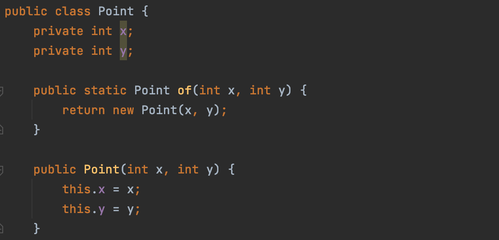
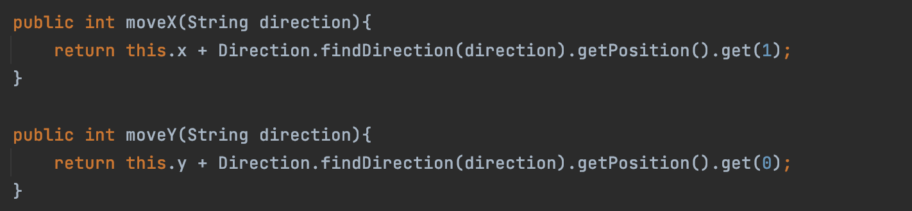

# 클래스의 역할과 책임

아래의 클래스는 x, y와 같은 두 멤버 변수를 가지고 있어야 하지만 Point라는 객체에 담기게 되었다. 이렇게 하나의 객체 안에 
담기게 되면 이 클래스가 상태와 행위를 동시에 가지게 되는데 이를 통해 각자가 독립적으로 행동하며 유기적으로 하나의 프로그램을 
만들어 갈 수 있다.

  

   

# 객체지향 프로그래밍 

각 객체가 상태와 행위를 가지고 이에 따라 유기적으로 협력하는 것을 객체지향 프로그래밍 패러다임이라고 부르며 이는 대규모 
애플리케이션을 구성할 때 매우 효율적이다. 각 객체가 자신의 상태를 가지기 때문에 `메시지`를 통해서만 서로 소통하고 협력하며
이를 통해 각자의 역할과 책임을 가질 수 있기 때문이다. 아래의 경우에도 Hero 클래스가 자기 스스로 움직이게 되는데, 이를 통해 
다른 객체에게 수동적으로 의존하지 않아도 된다. 

  

