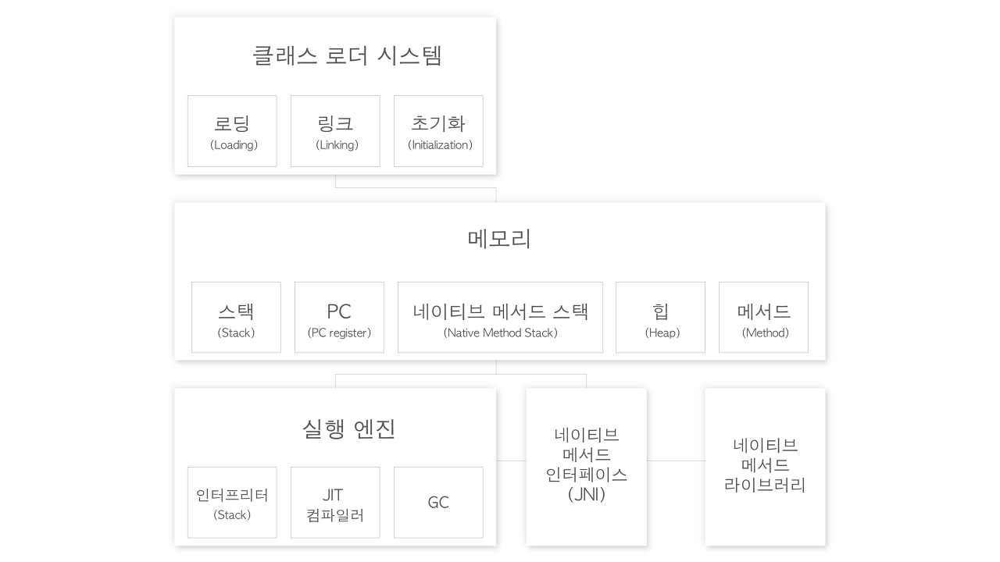
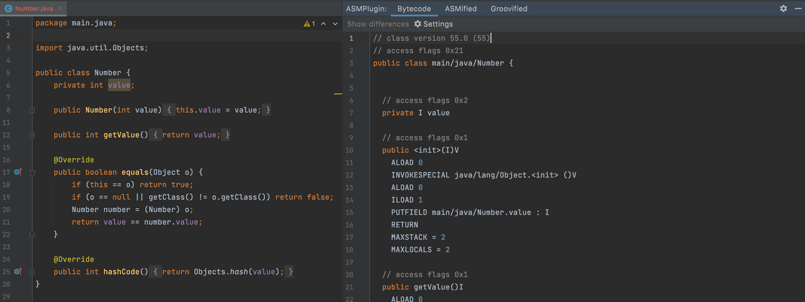
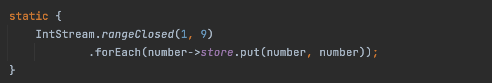
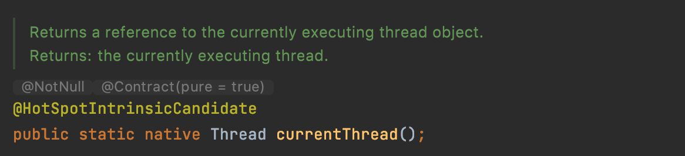

# 1. JVM
자바 바이트코드(.class)를 OS에 특화된 코드로 변환하여 실행하며, 바이트 코드를 실행하는 표준(JVM자체는 표준)이자 구현체 (특정 벤더가 구현한 JVM). 즉, JVM 바이트코드를 어떻게 실행시켜야하는지에 대한 스펙이다. JVM언어는 JVM기반으로 동작하는 프로그래밍 언어를 가리키며 클로저, 그루비, JRuby, Jython, Kotlin, Scala 등이 있다.
 

   

우리가 일반적으로 보고 있는 코드들은 원래 바이트코드로 이루어져 있는데, 자바 P를 통해 사람이 읽을 수 있는 코드로 컴파일 된다. JVM은 자바 바이트코드를 읽어들여 메모리에 적절하게 배치하는 것이다.
 

   

## 1-1. 클래스 로더
JVM은 크게 클래스 로더, 메모리, 실행 엔진으로 나눌 수 있는데 클래스 로더는 실제 바이트 코드를 읽어와 레퍼런스를 참조하고 초기화를 시킨다. 예를들어 static 블록을 통해 값을 할당하고 초기화하며, 이를 통해 다른 클래스에서도 해당 클래스 이름으로 이를 참조할 수 있게 한다.
 

   

## 1-2. 메모리
메모리에서 메서드와 힙을 제외한 나머지 영역은 모두 해당 영역의 스레드에 국한된다. 각 영역은 스택을 별도로 가지는데 스레드마다 런타임 스택을 만들어 그 안에 스택 프레임을 쌓는다. 대표적으로 에러가 발생했을 때 쌓이는 콜스택이 있다. 또한 메모리에는 현재 어느 위치를 가리키는지를 알려주는 PC레지스터 영역도 존재한다. 마지막으로 네이티브 메서드 스택도 스레드마다 존재하는데, 이는 네이티브 메서드라이브러리를 사용하는 것을 도와준다. *JIN을 사용하는 스택은 네이티브 메서드 스택에 쌓인다. 이 메서드는 C나 C++의 네이티브 메서드를 말한다.

 

|제목|내용|
|:--------:|---|
|메서드 영역|클래스 수준의 정보를 저장한다. 해당 클래스의 풀 패키지 경로, 클래스 이름, 부모 클래스 이름(상속 받은 클래스 이름), 클래스의 메서드들에 대한 정보가 저장된다.|
|힙 영역|클래스의 인스턴스(객체)를 저장한다. *객체를 만들지 않아도 클래스 타입의 객체가 생성된다.|

   

대표적으로 자바의 currentThread( )가 네이티브 메서드를 호출한다. JNI는 네이티브 메서드를 호출할 수 있도록 해준다. JNI를 통해 라이브러리를 사용해야 한다. *자바 네이티브 메서드를 호출해주는 인터페이스.

   

## 1-3. 실행엔진
인터프리터는 바이트코드를 이해할 수 있으며 이를 한 줄 씩 바꿔서 기계가 이해할 수 있도록 컴파일한다. 이렇게 한 줄씩 네이티브 언어로 컴파일하는 과정에서 같은 코드가 나올 때마다 이를 네이티브 코드로 바꾸는 것이 비효율적이기 때문에 이미 컴파일 된 코드일 경우 JIT컴파일러에 보내 (바이트코드를 네이티브 코드로) 이미 변환된 코드를 사용한다. 이를 통해 프로그램의 실행속도를 올릴 수 있으며, 실행엔진 내부의 GC(Garbage Collector)는 더 이상사용하지 않는 객체를 찾아 제거한다.

   

## 1-4. 흐름 정리
클래스로더가 클래스 정보를 읽어와 알맞는 메모리 공간에 바이트 코드를 배치한다. 힙과 메서드 영역에 이를 배치하고 각 스레드에 맞게 실행할 때 어떤 스레드가 만들어지면 스택, PC, 네이티브 메서드 스택이 만들어진다. 실행 엔진이 이르르 한줄 씩 실행하면서 빼서 더하고 스택을 사용한다. 한줄한줄 씩 컴파일 하는 것이 비효율적이니 사용하지 않는 것들을 찾아서 제거해준다. JNI를 통해서 사용하게 된다

