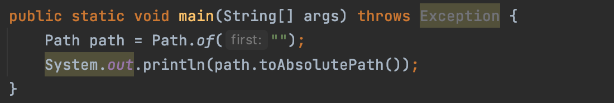
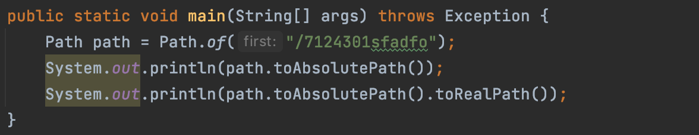
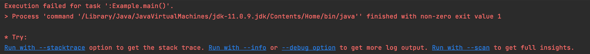
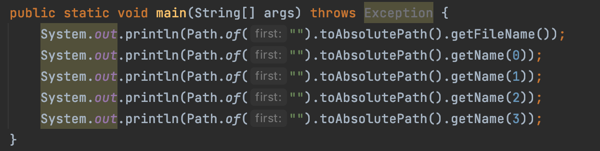
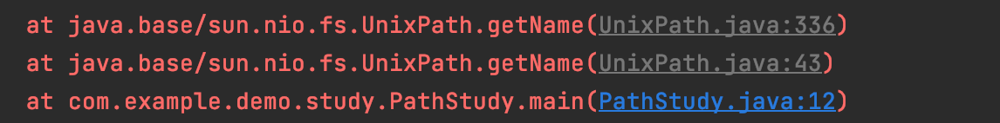
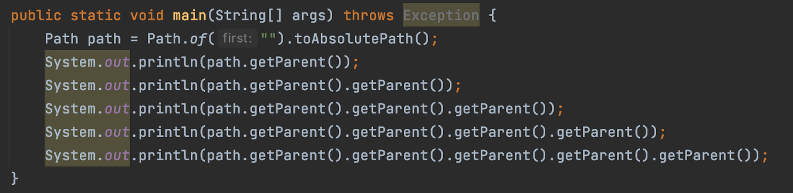

# File과 Path

쉘 미션을 수행하기 위해서는 File을 학습해야 했고, File을 사용하기 위해서는 Path를 잘 이해해야 해서 Path를 먼저 학습했습니다.

<br/><br/>

## 1.Path

유닉스, 리눅스 윈도우, 맥 OS 등 운영체제에서 디렉토리나 파일의 위치 정보를 의미하며, 대부분의 운영체제는 경로 정보를 트리 구조로 관리하고 있다. *파일 NIO에서 제공하는 Path는 운영체제의 파일 시스템에
관리하는 디렉토리, 파일, 링크의 절대적 혹은 상대적 위치를 표현한다. 이는 자바 6까지는 패스 정보를 File 클래스에 포함되어 있었으나 File 클래스가 파일, 디렉터리에 대한 정보 뿐 아니라 경로에 대한 정보도
포함하고 있었는데, 자바 7에서는 경로 정보를 Path 인터페이스로 분리했다.
<br/>

|   명칭    |   Explain   |
| :--------| :---|
| 루트 |  트리의 가장 처음 시작 지점 |  
| 파일 구분자 | 유닉스와 리눅스 계열는 /, 윈도우 계열은 \| 
| 상대 / 절대 경로 | 경로는 상대적 위치 정보와 절대적 위치 정보로 표현할 수 있다. 절대 경로는 운영체제의 루트를 기준으로 자원이 있는 위치를 의미하며 상대 경로는 현재 있는 위치에서 상대적 경로를 의미한다. 즉, 상대 경로는 특정 자원의 위치정보를 기준으로 다른 자원의 위치를 표시하는 방법이다. |
| 링크 |유닉스/리눅스에서는 심볼릭 링크, 윈도우에서는 "바로 가기"가 이에 해당한다. 상대/절대 경로에 있는 자원의 위치 정보를 특정한 위치로 연결해서 사용한다. 물리적 위치는 고정시키고 다른 곳에서 이를 활용할 때 유용하다.

<br/><br/><br/>

Path는 리눅스/유닉스 혹은 윈도우에서 사용하는 경로 정보는 서로 호환되지 않으며 심지어 디렉터리 위치가 동일하더라도 운영체제가 다른 곳에서 취득한 Path 정보는 동일하게 취급되지 않는다. 또한, 반드시 해당
위치에 파일 혹은 디렉터리가 있다는 것을 의미하지는 않는다.

Path 객체의 정보는 다양한 방법으로 생성되고 계산되고 분리되기 때문에 절대/상대 값등의 개념 등도 포함되어 실제 파일 시스템 정보를 의미하지 않을 수 있다. 따라서 Path를 기반으로 물리적인 작업을 할 때는
파일 혹은 디렉터리가 실제로 존재하는지 항상 확인해야 한다.
<br/>



<br/><br/><br/>

Path 인터페이스는 파일 혹은 디렉터리의 위치 정보를 포함하고 있으며 Paths 크래스를 이용해서 객체를 생성할 수 있다. 파일 NIO는 static 메서드를 이용해서 객체들을 생성하고 활용할 수 있는 팩토리
메서드 제공하는데 경로 정보를 생성하기 위해 Paths 클래스를 이용하면 아래 내부 코드를 함축한다.
<br/>

```java
Path path=FileSystems.getDefault().getPath("/address");
```

<br/><br/><br/>

또한 toAbsolutePath와 같은 메서드는 해당 경로 정보를 이용해 값을 출력했기 때문에 운영체제 내에 해당 경로가 존재하지 않아도 에러가 발생하지 않았지만, 실제 시스템상에 존재하지 않으면 오류를 발생시킨다.
<br/>




<br/><br/><br/>

파일 시스템의 기본 객체를 얻어와 주어진 문자열 경로 정보를 기반으로 Path 객체를 생성한 것이며 Paths.get과 동일한 결과를 얻을 수 있다. Paths 클래스는 Path 처리를 위한 유틸리티 메서드를 모아
놓은 클래스다.

Path 객체의 디렉터리 정보는 경로의 디렉터리 구분자를 기준으로 분해한 정보를 Path 내에서 관리하고 있다. Path 객체의 getName 메서드에 인덱스 정보를 기술하며 경로의 루트로부터 디렉터리의 깊이만큼
순서대로 디렉터리 명을 확인할 수 있다. 이는 프로젝트까지의 경로만 알 수 있는데, 그 이후의 경로를 얻기 위해서는 추가적인 설정이 필요하다.
<br/>



<br/><br/><br/>

프로젝트 이후에 경로를 얻기 위해 인덱스를 늘리면 IllegalArgumentException이 발생하게 된다.
<br/>



<br/><br/><br/>

getParent( )메서드는 자신의 상위 디렉토리 부모를 찾는다. 시작점까지 가게 되면 null이 반환된다. * 이 이외에도 Path 인터페이스는 다양한 메서드를 제공한다.
<br/>




