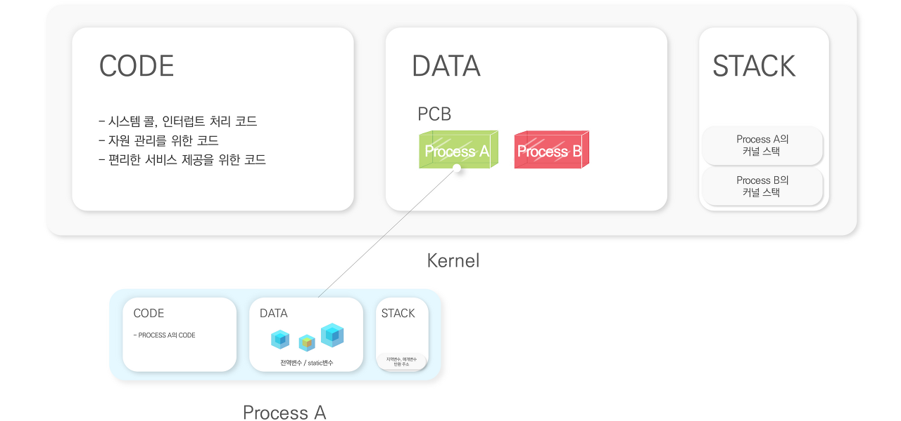
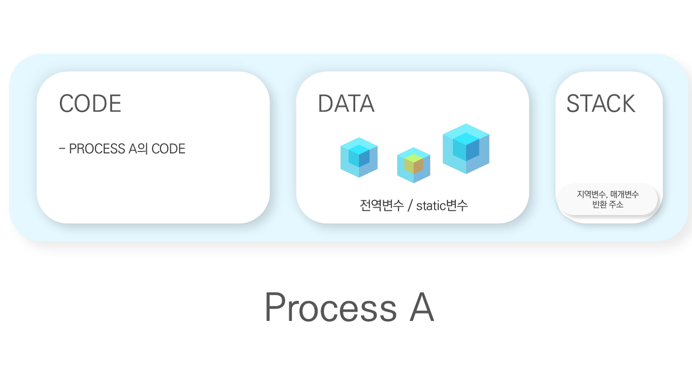
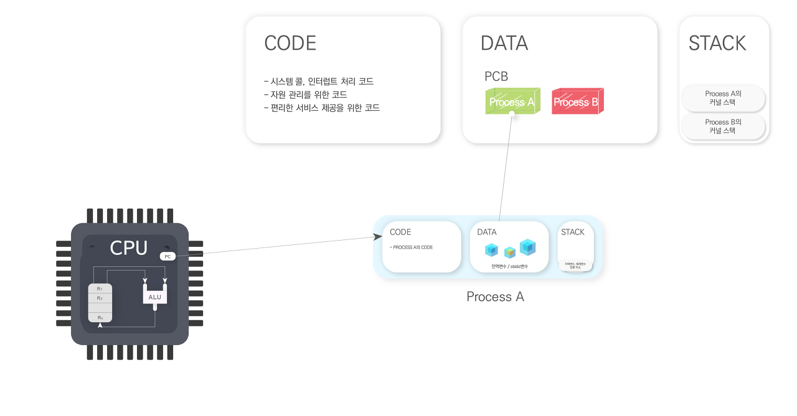
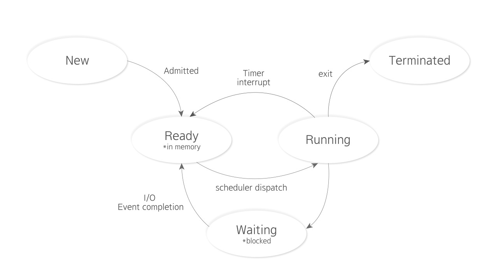

# 1. 프로세스

CPU가 특정 시점에서 어디까지 작업을 진행했는지 파악하는 것. 프로세스는 프로그램이 실행될 때 자신만의 독자적인 공간을 형성하며 프로세스내부에 Stack, Data, Code 영역이 존재한다. 각 프로세스는 커널의
Data 영역에 저장되며 아래와 같은 정보가 저장된다.

- 프로그램 카운터가 어디를 가리키는지 < - > 코드의 어디까지 수행했는지
- 프로세스의 어떤 내용을 담고 있는가 < - > 스택에 어떤 내용이 어디까지 쌓여 있는가
- 이 변수는 어떻게 바뀌었는지, 레지스터에 어떤 값을 넣고 어떤 인스트럭션까지 실행했는지

 

    

## 1-1. CPU 수행 상태를 나타내는 하드웨어 문맥

2CPU와 관련된 문맥. 프로세스는 CPU는를 잡고 매 순간 인스트럭션을 실행한다. 현재 시점에 인스트럭션을 어디까지 진행헀는지 알기위해서는 레지스터에 어떤 값을 가지고 있었고 프로그램 카운터가 어디를 가리키는지
등을 알고 있어야 한다. 주로 레지스터가 어떤 값을 가지고 있었는지를 나타낸다.

- Program Counter : 프로그램 카운터는 CPU의 레지스터(Register)안에 존재한다. 이는 다음에 작업해야 할 코드의 위치를 가리키며 CPU가 해당 작업을 수행할 수 있도록 안내하는 역할을 한다.
- 각종 register : register가 어떤 값을 저장하고 있는지

   

## 1-2. 프로세스의 주소공간

 

|  주  |학습 키워드|
|:---:|:-------|
| code |&nbsp; CPU에서 실행할 코드. 각 인터럽트마다 어떤 작업을 처리할 지 등이 커널 코드에 함수형태로 정해져있다|
| data |&nbsp; 전역 변수(변수), 자료구조 data는 변수|
| stack |&nbsp; 함수 구조로 돼 있기 때문에 데이터를 쌓는 용도|

   

## 1-3. 프로세스 관련 커널 자료 구조

프로세스를 관리하는 것도 운영체제의 역할 중 하나. 커널의 데이터 영역에 존재하며 각각의 프로세스마다 고유의 PCB가 있다.인터럽트 발생 시 프로세스의 문맥을 저장한다. 프로세스가 새로 생길때마다 이를 관리하기 위해
자신의 데이터 영역에 자료구조(PCB)를 두고 있는데 이때 프로세스에 CPU와 메모리를 얼마나 할당할지, 어디까지 작업을 했는지 등을 저장하고 관리하는 역할을 운영체제가 담당 한다. 따라서 프로세스의 현재 상태를
알려면 운영체제가 프로세스의 어떤 값을 가지고 있는지, 이를 어떻게 처리할 계획인 지 등도 알아야 한다.
 
 

   

## 1-4. 커널 주소공간의 Data영역에 존재

각 프로세스는 커널의 Data영역에 존재하며 각각의 독자적인 공간을 가진다. 커널은 여러 프로세스들이 공유하는 코드다. 운영체제에게 요청하기 때문에. 누구의 부탁을 받고 실행하는지(스택에 쌓였을 때) 커널 스택을
프로세스마다 두고 있다. 프로세스가 CPU를 가지면 프로그램 카운터(PC)가 프로세스의 코드를 가리킨다. CPU는 매 순간 인스트럭션(Instruction)을 실행하며 CPU로 CODE를 가져와 ALU에서 연산을 한
후 이를 레지스터나 바깥 메모리에 저장한다.

- Kernel stack (프로세스 별로 커널스택 별도로 둠. 어느 프로세스의 부탁을 받고 실행하는지 매번 다르기 때문)
- 커널 주소공간의 Stack영역에 존재
- 커널에서 함수 호출이 이루어지면 커널 스택에 관련된 정보 저장
    

    
프로그램 카운터가 어디를 가리키고 있는지 알아야 한다. 어떤 메모리 담고 있는지, 스택에 어떤 것이 쌓여있는지 어디까지 쌓아놨는지. 만약 사용자가 system call 하면 program counter가 커널의
어딘가를 가리키고 커널의 코드를 실행한다. 커널이 누구의 부탁을 받는건 매번 다르다. 커널을 프로세스별로 스택을 별도로 둔다. 이런 정보들을 알고 있으면 인터럽트 후에 돌아와도 프로세스가 어떤 상태에 있는지 알 수
있다.
     

# 2. 프로세스의 상태

프로세스는 자원을 효율적으로 사용하기 위해 몇 가지 상태가 있다. 큐는 운영체제 커널이 자료구조 큐를 만들고 프로세스의 상태를 만들고 ready상태 중 CPU를 주고 이런식으로 운영을 하는 것. 프로세스는 상태가
변경되며 작업을 수행한다. 프로세스의 작업은 CPU를 기준으로 나눌 수 있으며 CPU를 가지고 작업을 수행중(Running)인 지, 대기중(Ready)인 지, 작업을 중단(Blocked)했는지, 당했는지(
Suspended)로 나뉜다.

 

|  주  |학습 키워드|
|:---:|:-------|
| Running |&nbsp; CPU가 프로세스를 잡고 인스트럭션을 수행중인 상태|
| Ready |&nbsp; 메모리에 올라간 채로 CPU의 작업을 대기하는 상태. Ready 상태에 있는 프로세스들이 순서대로 CPU를 가지고 작업 한다.|
| Blocked |&nbsp; 프로세스 자신이 요청한 이벤트가 즉시 만족되지 않아 이를 기다리는 상태|
| Suspended |&nbsp; 외부적 이유로 프로세스의 수행이 정지된 상태. 프로세스가 통채로 디스크에 swap out된다.

  

* Blocked 상태는 자신이 요청한 이벤트가 만족되면 Ready 상태가 되지만 Suspended 상태는 외부에서 resume 해 줘애 다시 작업을 수행할 수 있다.
    

