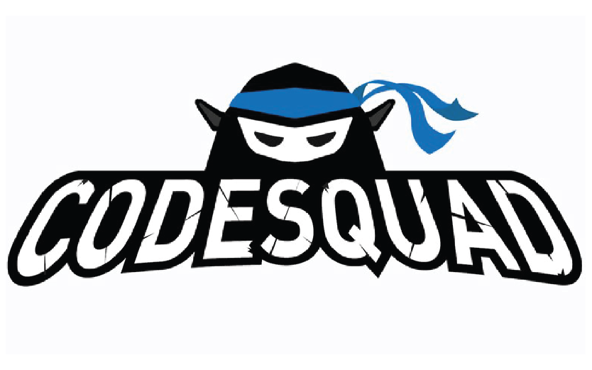

# CodeSquad Cocoa

[코드스쿼드 코코아 과정](https://codesquad.kr/page/masters/cocoa.html) 을 들으며 학습한 내용을 기록하기 위한 저장소입니다.

&nbsp;&nbsp;&nbsp;&nbsp;  - [학습내용 정리](#학습내용-정리) 
&nbsp;&nbsp;&nbsp;&nbsp;  - 회고([1주차](https://frost-armadillo-835.notion.site/1-f7b4e5c543ba4de08dea4d4db8b4a435), [2주차](https://frost-armadillo-835.notion.site/2-8b505e1aee6f451ea5734c6131586d0d)  
&nbsp;&nbsp;&nbsp;&nbsp;  - [알고리즘 문제풀이](https://github.com/devjun10/Algorithm/blob/master/src/main/resources/contents/programmers.md)

q
  

   

## 학습내용 정리

각 주차에 학습했던 키워드와 간단한 회고를 정리한 링크입니다.
  

|  주  |  학습 키워드                                                                                     |주소                               |
|:---:|:---------------------------------------------------------------------------------------------------------------------------------|:-------------------------------:|
| 1 주 |&nbsp; Intellij, Github, PR, 마크다운, 구현, JVM, 배열, 클래스, 객체지향, 함수, Call by Value, 콜스택/재귀  |[링크](contents/week01/readme.md) |   
| 2 주 |&nbsp; 역할과 책임, 함수형 프로그래밍, 페어 프로그래밍, 변수, 운영체제, 상속, 인터페이스, 제네릭, 컬렉션 라이브러리, 참조형                                            |[링크](contents/week02/readme.md) |
| 3 주 |&nbsp; |[링크]()|

  

